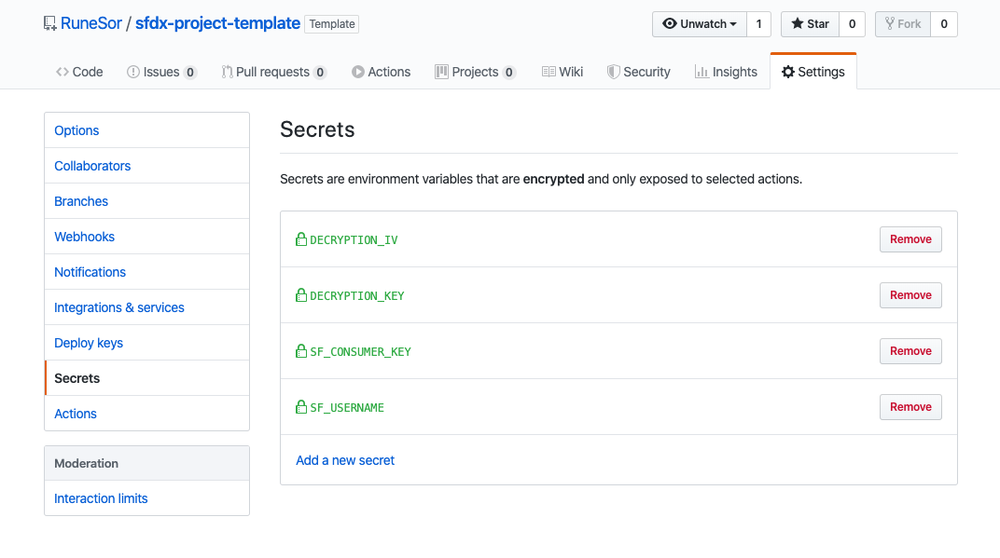
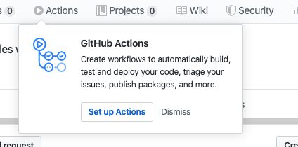

Build Status:  


# sfdx-project-template  
Template for new projects, including tools i find useful in my day-to-day tasks using SFDX

## Getting Started
1) [Fork](http://help.github.com/fork-a-repo/) this repo to your GitHub account using the fork link at the top of the page.

2) Clone your forked repo locally: `git clone https://github.com/<git_username>/sfdx-project-template.git`

3) Make sure that you have Salesforce CLI installed. Run `sfdx force --help` and confirm you see the command output. If you don't have it installed, download and install it from [here](https://developer.salesforce.com/tools/sfdxcli).
4) Setup a JWT-based auth flow for the target orgs that you want to deploy to. This step creates a `server.key` file that is used in subsequent steps.
(https://developer.salesforce.com/docs/atlas.en-us.sfdx_dev.meta/sfdx_dev/sfdx_dev_auth_jwt_flow.htm)

5) Confirm that you can perform a JWT-based auth: `sfdx force:auth:jwt:grant --clientid <your_consumer_key> --jwtkeyfile server.key --username <your_username> --setdefaultdevhubusername`

   **Note:** For more info on setting up JWT-based auth, see [Authorize an Org Using the JWT-Based Flow](https://developer.salesforce.com/docs/atlas.en-us.sfdx_dev.meta/sfdx_dev/sfdx_dev_auth_jwt_flow.htm) in the [Salesforce DX Developer Guide](https://developer.salesforce.com/docs/atlas.en-us.sfdx_dev.meta/sfdx_dev).

6) Encrypt and store the generated `server.key`.  IMPORTANT!  Don't store the `server.key` within the project.

- First, generate a key and initializtion vector (iv) to encrypt your `server.key` file locally. The `key` and `iv` are used by GitHub Workflow to decrypt your server key in the build environment.


```bash
$ openssl enc -aes-256-cbc -k <passphrase here> -P -md sha1 -nosalt
  key=E5E9FA1BA31ECD1AE84F75CAAA474F3A663F05F412028F81DA65D26EE56424B2
  iv =E93DA465B309C53FEC5FF93C9637DA58
```

> Make note of the `key` and `iv` values output to the screen. You'll use the values following `key=` and `iv =` to encrypt your `server.key`.

- Encrypt the `server.key` using the newly generated `key` and `iv` values. Use the `key` and `iv` values only once. Don't use them to encrypt more than the `server.key`. While you can re-use this pair to encrypt other things, it's considered a security violation to do so. Every time you run the command above, it generates a new `key` and `iv` value. You can't regenerate the same pair. If you lose these values, generate new ones and encrypt again.

```bash
openssl enc -nosalt -aes-256-cbc -in assets/server.key -out assets/server.key.enc -base64 -K <key from above> -iv <iv from above>
```
 This step replaces the existing `server.key.enc` with your encrypted version.

- Store the `key`, and `iv` values somewhere safe. You'll use these values in a subsequent step in the Bitbucket Pipeplines UI. These values are considered *secret* so please treat them as such.

7) From your JWT-based connected app on Salesforce, retrieve the generated `Consumer Key` from your Dev Hub org.

8) Set your `Consumer Key` in a Workflow Secrets environment variable named `SF_CONSUMER_KEY` using the UI. Set your `Username` in a Workflow Secrets environment variable named `SF_USERNAME` using the UI.  Note that this username is the username that you use to access your Dev Hub.

9) Store the `key` and `iv` values used above in Workflow Secrets environment variables named `DECRYPTION_KEY` and `DECRYPTION_IV`, respectively. When finished setting the Secrets variables it should look something like the image below.



10) Update the contents of `sfdx-project.json` and `project-scratch-def.json` if needed and save.

14) Commit the updated `sfdx-project.json`,`project-scratch-def.json`, and `server.key.enc` files.

Now you're ready to Set up Actions (se image). 



Then, when you commit and push a change, your change kicks off a Workflow build.

Enjoy!

